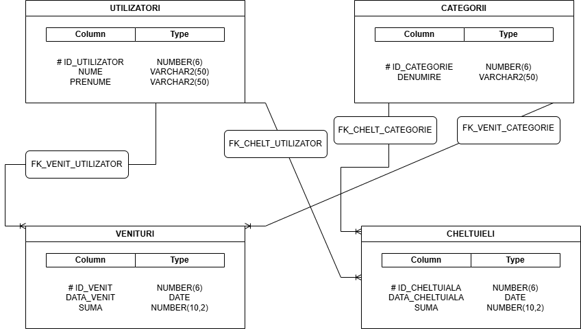

# Budget-Manager
Oracle SQL project for personal finance management. Features a relational database schema with complex queries, joins, views, and data analysis.

# Personal Budget Management System (Oracle SQL) 💰

## Project Overview
This project consists of a relational database designed to manage personal finances efficiently. The main goal is to provide a practical tool for tracking and analyzing income and expenses for multiple users.

**Note:** The source code and database identifiers (table names, columns) are written in **Romanian** as part of the original academic requirements. A translation key is provided below.

## Key Features
* **Relational Database Structure:** Built on 4 main tables: Users, Categories, Income, and Expenses.
* **Data Integrity:** Enforced using Primary Keys, Foreign Keys, and CHECK constraints (e.g., ensuring positive amounts).
* **Complex Reporting:** Includes advanced SQL queries to generate financial insights, such as total expenses per category and monthly balance analysis.

## 📂 Technical Dictionary (Romanian to English)
To help navigate the code, here are the mappings for the main entities:

| Romanian (Code) | English (Meaning) |
| :--- | :--- |
| **`utilizatori`** | Users |
| **`categorii`** | Categories |
| **`venituri`** | Income |
| **`cheltuieli`** | Expenses |
| **`suma`** | Amount |
| **`data`** | Date |

## 🛠 Technical Skills Demonstrated
* **DDL & DML Operations:** Creating tables, sequences, and managing data.
* **Advanced SQL Querying:**
    * **Joins:** Retrieving data across multiple tables.
    * **Aggregate Functions:** `SUM`, `AVG`, `COUNT` combined with `GROUP BY`.
    * **Set Operators:** Using `MINUS`, `UNION`.
    * **Performance:** Created Views and Indexes for optimization.

## Database Schema

